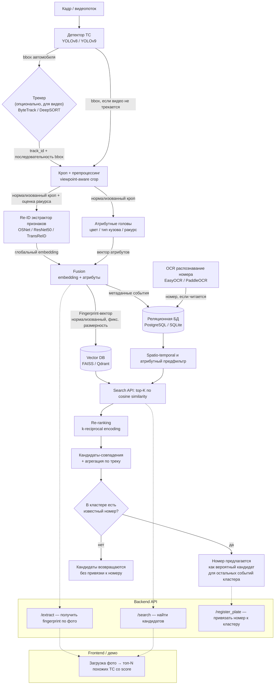

# Архитектура сервиса Vehicle Re-Identification (Re-ID)

## 1. Общее описание системы и цели

Сервис Vehicle Re-Identification (Re-ID) решает задачу построения устойчивого «цифрового отпечатка» автомобиля на основе его визуальных признаков — типа кузова, марки и модели, цвета, геометрии, повреждений, наклеек, дисков, тонировки и других деталей внешнего вида — принципиально **не опираясь на государственный регистрационный номер**. Это позволяет узнавать одно и то же транспортное средство на разных камерах и в разное время даже тогда, когда номер физически не читается (загрязнён, заклеен, снят, размыт из-за движения или ракурса, скрыт другим объектом и т.д.).

Ключевой сценарий применения — розыск и сопоставление: если для части эпизодов (кластера событий, относящихся к одному и тому же автомобилю) номер ранее был успешно распознан хотя бы один раз, система может предложить его в качестве вероятного кандидата для остальных эпизодов того же кластера, где номер не читается. Таким образом Re-ID выступает не заменой автоматического распознавания номеров (ANPR/OCR), а дополняющим механизмом, повышающим полноту и устойчивость идентификации транспортных средств в системах видеонаблюдения и аналитики дорожной обстановки.

## 2. Диаграмма потока данных

## 3. Компоненты системы

Ниже подробно описан каждый из девяти компонентов пайплайна: его назначение, вход, выход, ключевые архитектурные решения и зона ответственности.

### 3.1. Детекция ТС (Vehicle Detection)

| Параметр | Описание |
|---|---|
| **Назначение** | Найти на кадре все объекты класса «транспортное средство» и вернуть их ограничивающие прямоугольники (bounding box). Это первый фильтр, отделяющий полезную область кадра от фона. |
| **Вход** | Сырой кадр изображения или кадр видеопотока (RGB-массив пикселей). |
| **Выход** | Список bbox с классом объекта (легковой автомобиль, грузовик, автобус и т.д.) и confidence score. |
| **Ключевые решения / альтернативы** | Используется предобученная модель **YOLOv8n/s** (либо YOLOv9) без дообучения — достаточной точности на типовых сценах видеонаблюдения хватает «из коробки». Дообучение рассматривается как опциональное улучшение при явной деградации качества на специфичных ракурсах камер. |
| **Зона ответственности** | Только локализация объекта на кадре. Не занимается классификацией марки/модели, не извлекает признаки — это задачи последующих модулей. |

### 3.2. Трекинг (опционально, для видео)

| Параметр | Описание |
|---|---|
| **Назначение** | Связать детекции одного и того же автомобиля между последовательными кадрами **в рамках одной камеры**, сформировав трек (track) — непрерывную траекторию объекта во времени. |
| **Вход** | Последовательность bbox от детектора по кадрам видеопотока. |
| **Выход** | track_id, привязанный к последовательности bbox и временным меткам, относящимся к одному физическому объекту в поле зрения одной камеры. |
| **Ключевые решения / альтернативы** | Модуль опционален и активируется только для видеопотока (для одиночных фото — не применяется). Рассматриваются **ByteTrack** (быстрый, association-based трекер, не требует дополнительного re-id внутри трекера) и **DeepSORT** (использует собственный embedding для ассоциации, более ресурсоёмкий). Наличие трекинга даёт возможность агрегировать признаки по треку вместо одного кадра (см. раздел 4). |
| **Зона ответственности** | Ассоциация детекций **внутри одной камеры**. Кросс-камерное сопоставление — не его задача, этим занимается модуль поиска по векторной БД (п. 3.6) и логика matching (раздел 4). |

### 3.3. Кроп + препроцессинг (viewpoint-aware crop)

| Параметр | Описание |
|---|---|
| **Назначение** | Вырезать область автомобиля из кадра по bbox, привести её к нормализованному виду, пригодному для подачи в Re-ID модель, и оценить ракурс съёмки (фронтальный, боковой, задний, диагональный). |
| **Вход** | Исходный кадр + bbox (от детектора или трекера). |
| **Выход** | Нормализованный кроп изображения (фиксированный размер, цветовая нормализация) + метка/оценка ракурса. |
| **Ключевые решения / альтернативы** | Реализуется на **OpenCV**. «Viewpoint-aware» означает, что кроп и последующая обработка учитывают ракурс — это важно, поскольку внешний вид автомобиля сильно различается спереди, сбоку и сзади, и Re-ID модель должна получать эту информацию (напрямую как признак или через выбор соответствующей ветки обработки). |
| **Зона ответственности** | Только геометрическая и цветовая подготовка изображения плюс оценка ракурса. Не извлекает семантические признаки (цвет кузова, тип кузова как атрибуты) — этим занимаются атрибутные головы. |

### 3.4. Re-ID модель (экстрактор embedding)

| Параметр | Описание |
|---|---|
| **Назначение** | Самое тяжёлое и центральное звено пайплайна — извлечь из нормализованного кропа плотный векторный embedding, устойчиво описывающий визуальную идентичность автомобиля (кузов, повреждения, наклейки, диски, тонировку, геометрические особенности) независимо от освещения, ракурса и качества съёмки. |
| **Вход** | Нормализованный кроп автомобиля (выход п. 3.3). |
| **Выход** | Глобальный embedding-вектор фиксированной размерности. |
| **Ключевые решения / альтернативы** | Реализация на **PyTorch** с использованием готовых тулбоксов re-id (**FastReID**, **torchreid**). Два варианта бэкбона: **OSNet** или **ResNet50** — быстрый вариант с приемлемой точностью, подходящий для демонстрации в реальном времени; **TransReID** (на основе Vision Transformer) — более точный, но существенно более медленный вариант, рассматривается как опция при наличии вычислительных ресурсов и требований к максимальному качеству. |
| **Зона ответственности** | Только извлечение глобального визуального embedding. Атрибуты (цвет, тип кузова) извлекаются отдельным модулем (может быть общим backbone с разными головами). |

### 3.5. Атрибутные головы (цвет / тип кузова / ракурс)

| Параметр | Описание |
|---|---|
| **Назначение** | Извлечь дополнительные, интерпретируемые признаки автомобиля (цвет, тип кузова — седан/внедорожник/хэтчбек/грузовик и т.д., ракурс), которые используются как быстрый предфильтр кандидатов до дорогостоящего векторного поиска и re-ranking. |
| **Вход** | Нормализованный кроп (тот же вход, что у Re-ID модели), опционально — общие промежуточные признаки backbone. |
| **Выход** | Набор атрибутов: категориальные метки (цвет, тип кузова) и оценка ракурса, каждая — с confidence. |
| **Ключевые решения / альтернативы** | Может быть реализовано как дополнительные головы (heads) той же сети, что и Re-ID backbone (multi-task обучение, разделяемые признаки), либо как отдельные лёгкие классификаторы, работающие независимо. Выбор конкретной реализации — компромисс между скоростью инференса (общий backbone дешевле) и модульностью/простотой замены (отдельные классификаторы проще дообучать независимо). |
| **Зона ответственности** | Только извлечение атрибутов для предфильтрации. Не участвует в финальном ранжировании по векторному сходству — это делает модуль поиска (п. 3.6). |

### 3.6. Vector DB / поиск

| Параметр | Описание |
|---|---|
| **Назначение** | Хранить fingerprint-векторы всех зарегистрированных наблюдений автомобилей и выполнять приближённый поиск ближайших соседей (ANN, Approximate Nearest Neighbors) по косинусному сходству, а также re-ranking отобранного множества кандидатов. |
| **Вход** | Fingerprint-вектор запроса (для поиска) или fingerprint-вектор + метаданные (для регистрации новой записи). |
| **Выход** | Список top-K ближайших fingerprint-векторов с оценками сходства (до и после re-ranking). |
| **Ключевые решения / альтернативы** | Два варианта: **Qdrant** — полноценный векторный движок, разворачиваемый в Docker, с поддержкой фильтрации по метаданным на уровне БД, персистентностью и API; **FAISS** — библиотека без отдельного сервера, встраиваемая прямо в backend-процесс, проще в развёртывании для хакатон-демо, но без встроенной персистентности и сетевого API «из коробки». Выбор между ними — компромисс между простотой быстрого прототипирования (FAISS) и приближённостью к продуктовому решению (Qdrant). |
| **Зона ответственности** | Векторное хранение и ANN top-K поиск + re-ranking по эмбеддингам. Не хранит и не обрабатывает реляционные метаданные (camera_id, timestamp, номер) — это зона ответственности реляционной БД (п. 3.7), связь между записями осуществляется по общему идентификатору. |

### 3.7. Метаданные (реляционная БД)

| Параметр | Описание |
|---|---|
| **Назначение** | Хранить структурированную информацию о каждом зафиксированном событии/наблюдении автомобиля, которая используется для предфильтрации кандидатов, для интерпретации результатов поиска человеком и для связывания эпизодов с распознанными номерами. |
| **Вход** | Данные о событии: идентификатор камеры, временная метка, координаты bbox, ссылка на fingerprint-вектор, распознанный номер (если есть), атрибуты (цвет, тип кузова, ракурс). |
| **Выход** | Записи о наблюдениях, доступные для фильтрации по камере/времени/атрибутам и для сборки кластеров наблюдений одного и того же автомобиля. |
| **Ключевые решения / альтернативы** | **PostgreSQL** для полноценного развёртывания (конкурентный доступ, масштабируемость) либо **SQLite** для лёгкого локального прототипа/демо без отдельного сервера БД. |
| **Зона ответственности** | Хранение и фильтрация структурированных метаданных и связки «кластер наблюдений → распознанный номер». Не хранит и не обрабатывает сами векторы признаков. |

### 3.8. Backend API

| Параметр | Описание |
|---|---|
| **Назначение** | Предоставить внешним клиентам (frontend, интеграции, скрипты оценки) HTTP-интерфейс для получения fingerprint по фото, поиска похожих автомобилей и привязки известного номера к кластеру наблюдений. |
| **Вход** | HTTP-запросы: изображение (для /extract), изображение или fingerprint (для /search), идентификатор кластера + номер (для /register_plate). |
| **Выход** | JSON-ответы: fingerprint-вектор и атрибуты (/extract), ранжированный список кандидатов со score и метаданными, включая предложенный номер, если он известен для кластера (/search), подтверждение привязки (/register_plate). |
| **Ключевые решения / альтернативы** | **FastAPI** — обеспечивает автогенерируемую интерактивную Swagger/OpenAPI-документацию, что удобно как для интеграции, так и для демонстрации жюри. Три ключевых эндпоинта: `/extract` — получить fingerprint по фото; `/search` — найти кандидатов по фото или готовому fingerprint; `/register_plate` — вручную привязать распознанный/известный номер к кластеру наблюдений. |
| **Зона ответственности** | Оркестрация вызовов между модулями пайплайна (детекция → кроп → Re-ID → fusion → поиск), валидация запросов, формирование ответа. Не содержит бизнес-логику самих ML-модулей — является связующим слоем. |

### 3.9. Frontend / демо

| Параметр | Описание |
|---|---|
| **Назначение** | Наглядно продемонстрировать работу сервиса жюри и пользователям: загрузка фотографии автомобиля и визуализация топ-N наиболее похожих записей из базы с оценкой сходства и (при наличии) предложенным номером. |
| **Вход** | Загруженное пользователем изображение автомобиля. |
| **Выход** | Визуальное отображение результатов: миниатюры найденных автомобилей, score сходства, метаданные (камера, время), предложенный номер, если он есть у кластера. |
| **Ключевые решения / альтернативы** | **Streamlit** или **Gradio** — для максимальной скорости разработки прототипа без затрат на верстку; **React** — рассматривается как альтернатива при наличии времени и фронтенд-компетенций в команде для более полированного UI. |
| **Зона ответственности** | Только визуализация и пользовательское взаимодействие поверх Backend API. Не содержит собственной бизнес-логики поиска или обработки изображений. |

## 4. Логика сопоставления (matching)

Поиск кандидатов-совпадений по fingerprint-вектору выполняется в несколько последовательных этапов, каждый из которых сужает и уточняет множество кандидатов:

1. **Быстрый предфильтр по метаданным.** До обращения к векторному поиску кандидаты отсеиваются по атрибутам (цвет, тип кузова) и по физически разумному временному окну между камерами — с учётом топологии камер и расстояний между ними (автомобиль не может появиться на удалённой камере раньше, чем через минимально возможное время в пути). Это резко сокращает пространство поиска и отсекает заведомо невозможные совпадения ещё до дорогого векторного сравнения.

2. **ANN top-K по векторному сходству.** По оставшемуся после предфильтра (или по всему, если предфильтр не сужает пространство существенно) множеству выполняется приближённый поиск top-K ближайших fingerprint-векторов по косинусному сходству в векторной БД (FAISS/Qdrant).

3. **Re-ranking (k-reciprocal encoding).** Полученное top-K множество кандидатов дополнительно переранжируется методом k-reciprocal encoding — техникой, учитывающей не только прямое сходство запроса и кандидата, но и взаимную близость кандидатов друг с другом (симметричность отношения "ближайший сосед"), что повышает точность ранжирования по сравнению с простым сходством по косинусу.

4. **Агрегация по треку.** Если для наблюдения доступен трек (несколько кадров одного и того же автомобиля от трекера, п. 3.2), вместо построения fingerprint по единственному кадру выполняется усреднение (или иная агрегация) embedding-векторов по нескольким кадрам трека. Это делает итоговый fingerprint существенно устойчивее к шуму, бликам, частичным перекрытиям и неудачным ракурсам отдельных кадров.

Итогом всей цепочки является ранжированный список кандидатов-совпадений с оценками сходства. Если для части эпизодов финального кластера кандидатов ранее был распознан номер (через OCR, п. 5), этот номер предлагается как вероятный для остальных эпизодов кластера, где номер прочитать не удалось.

## 5. Формат fingerprint-вектора и схема хранения

### 5.1. Fingerprint-вектор

Fingerprint-вектор — это результат fusion-этапа пайплайна, объединяющий:

- **Глобальный embedding** — выход Re-ID backbone (OSNet/ResNet50/TransReID), плотный вектор фиксированной размерности, кодирующий общий визуальный облик автомобиля.
- **Атрибутные признаки** — векторизованное представление атрибутов (цвет, тип кузова, ракурс), полученных атрибутными головами.

Итоговый вектор нормализуется (например, L2-нормализация) и имеет **фиксированную размерность**, что необходимо для корректной работы косинусного сходства и индексации в векторной БД. Именно этот вектор — а не исходное изображение — хранится как «цифровой отпечаток» автомобиля и используется для всех операций сравнения и поиска.

### 5.2. Хранение в векторной БД (FAISS / Qdrant)

Для каждой записи в векторном индексе хранится:

| Поле | Описание |
|---|---|
| `fingerprint_id` | Уникальный идентификатор вектора, связывающий запись в векторной БД с записью метаданных в реляционной БД. |
| `vector` | Сам fingerprint-вектор (нормализованный, фиксированной размерности). |

Основная описательная информация о событии (где, когда, какая камера, есть ли номер) хранится не в векторной БД, а в реляционной — векторная БД оптимизирована исключительно под быстрый ANN-поиск.

### 5.3. Хранение в реляционной БД (PostgreSQL / SQLite)

| Поле | Описание |
|---|---|
| `event_id` | Уникальный идентификатор события/наблюдения. |
| `fingerprint_id` | Ссылка на соответствующий вектор в векторной БД. |
| `camera_id` | Идентификатор камеры, зафиксировавшей событие. |
| `timestamp` | Временная метка события. |
| `bbox` | Координаты bbox автомобиля на исходном кадре. |
| `track_id` | Идентификатор трека (если событие получено из видеопотока с трекингом). |
| `plate_number` | Распознанный государственный номер (может отсутствовать, если OCR не смог его прочитать). |
| `plate_confidence` | Уверенность OCR-распознавания номера (если номер распознан). |
| `color` | Цвет автомобиля (атрибут). |
| `body_type` | Тип кузова (атрибут). |
| `viewpoint` | Ракурс съёмки (атрибут). |
| `cluster_id` | Идентификатор кластера наблюдений, к которому по итогам matching отнесено событие (объединяет эпизоды, распознанные как один и тот же автомобиль). |

Связь `cluster_id → plate_number` — ключевой механизм, реализующий сценарий «предложить известный номер для эпизодов без читаемого номера»: если хотя бы одно событие в кластере имеет распознанный номер, он предлагается как кандидат для всех остальных событий того же кластера.

## 6. Датасеты для обучения и валидации

Обучение и валидация Re-ID модели и атрибутных классификаторов не являются основным фокусом данного документа, однако для контекста ниже перечислены датасеты, релевантные задаче:

| Датасет | Назначение |
|---|---|
| **VeRi-776** | Основной бейзлайн-датасет (776 автомобилей, 20 камер) для базового обучения и оценки качества Re-ID. |
| **VeRi-Wild** | Крупномасштабный датасет (400k+ фото, 174 камеры) с разнообразными условиями погоды и освещения — для повышения устойчивости модели к реальным условиям. |
| **VehicleID** | Дополнительный датасет для обучения и валидации Re-ID моделей автомобилей. |
| **CityFlow / AI City Challenge Track 2** | Мультикамерный re-id датасет, наиболее близкий по постановке к реальному кейсу проекта (сопоставление автомобилей между разными камерами города). |
| **CompCars / Stanford Cars / BoxCars116k** | Датасеты для fine-grained классификации марки и модели автомобиля (атрибутные признаки). |
| **VehicleX** | Синтетический датасет, используемый для доменной адаптации модели к условиям, слабо представленным в реальных данных. |
