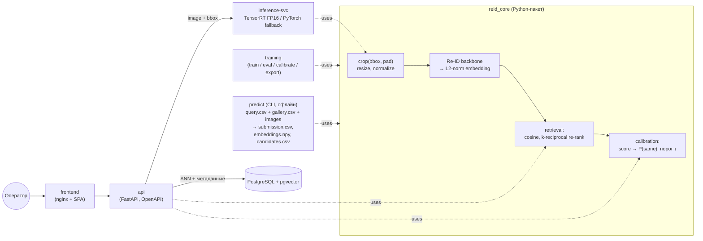

# Архитектура решения

Сервис строит визуальный эмбеддинг ТС по кропу из кадра (bbox задан) и ищет то же ТС в галерее без использования номера. Если уверенного совпадения нет, сервис отказывает.

Первоисточники: ТЗ — [`task.md`](task.md) (оригинал [`task.pdf`](task.pdf)), формат данных и сдачи — [`data/specs/README.md`](../data/specs/README.md), эталонный расчёт метрик — [`data/specs/evaluate.py`](../data/specs/evaluate.py). Технологии, модели и версии — [`tech-stack.md`](tech-stack.md). План работ — [`dev-plan.md`](dev-plan.md).

## 1. Откуда берутся баллы

| Вес | Критерий | Что в архитектуре за это отвечает |
|---|---|---|
| 45% | mAP@10 по `submission.csv` на закрытом тесте (протокол — §4.8) | ML-ядро + `predict` (офлайн-генерация артефактов сдачи) |
| 20% | Скорость: время признака на 1 ТС (батч=1) и FPS в пакете; веса ≤ 2 ГБ | Экспорт ONNX/TensorRT FP16, выбор backbone, пайплайн декодирования |
| 15% | Воспроизводимость, архитектура, Docker, документация | Микросервисы, `docker compose up` одной командой, Readme |
| 10% | Режим отказа: F1 и TNR при нашем пороге, решение на уровне запроса (§4.8) | Калибровка уверенности и порог τ на валидации с дистракторами |
| 10% | Защита | Обоснование порога, backbone, разбор ошибок |
| 0% | UI, Grad-CAM, ANN на 10⁶, анализ ошибок | Тай-брейкеры: делаются после основного |

**Главное следствие.** Оценку определяет контейнер `predict`, который организаторы сами запускают на закрытой части теста (ТЗ §8), а не веб-сервис. Поэтому в центре архитектуры одна библиотека `reid_core`. Её используют и обучение, и `predict`, и онлайн-сервис, так что препроцессинг и постобработка везде идентичны.

## 2. Границы задачи

Не входит в задачу (ТЗ §3, §5):

- **Детекция.** Bbox дан и в train, и в test.
- **Распознавание номеров.** Номера размыты, а использование любых признаков номера ведёт к дисквалификации.
- **Трекинг и пространственно-временная фильтрация.** На тесте нет `camera_id`, времени и геопривязки.
- **Потоковый приём с камер.** Вход — изображение и bbox через API или UI.

## 3. Данные (`data/specs/`)

| | Строк | Колонки | Примечание |
|---|---|---|---|
| `train.csv` | 9 556 | `image_id, x, y, w, h, vehicle_id, camera_id` | 1 541 ID, 96 камер, 4–8 кадров на ID, каждый ID снят на 2–8 камерах (чаще всего на 2) |
| `test_query.csv` | 1 110 | `image_id, x, y, w, h` | Идентификатор запроса — `image_id` |
| `test_gallery.csv` | 750 | `image_id, x, y, w, h` | Идентификатор кандидата — `image_id`; с query не пересекается |
| `images/` | 11 416 JPEG | — | 7.1 ГБ, в git не хранится (см. `.gitignore`) |

Что из этого следует:

- **Один кадр — одно ТС** (README датасета), поэтому `image_id` однозначно задаёт объект. В ТЗ сказано «несколько ТС на кадр», но фактический датасет устроен иначе.
- **`camera_id` в train есть**, хотя ТЗ говорило обратное. Он нужен для:
  - кросс-камерной валидации, повторяющей правило оценки «совпадения в пределах одной камеры исключаются»;
  - PK-семплинга с разнообразием камер внутри ID.

  В инференс его не подаём: на тесте камеры нет, поэтому camera-SIE и подобные приёмы отпадают.
- **Запросов больше, чем галереи** (1 110 против 750). Значит, есть запросы без пары в галерее (их нужно отказывать, это TNR) и/или несколько запросов на один ID.
- Bbox крупные: медиана около 670×490 px, минимум около 150 px. На входе модели достаточно 256×256.
- Все кадры — 1920×1080, baseline JPEG 4:2:0 без restart markers, в среднем 0.66 МБ (выборка 286 файлов). Декодирование полного кадра — заметная часть времени признака (§7).

## 4. Компоненты



### 4.1 `reid_core`

Единственное место, где живут:

- **Препроцессинг:** кроп по bbox с отступом (10%, клиппинг по границам кадра), resize (bilinear, antialias), нормализация — одни и те же torch-функции у всех потребителей. JPEG декодируется по-разному (при обучении — кэш кропов, в инференсе — nvJPEG на GPU), поэтому требуется не побайтное совпадение, а **функциональный паритет** (§4.9).
- **Модель:** backbone и проекционная голова; на выходе L2-нормированный float32-вектор **D = 512** — для любого backbone (`tech-stack.md` §2.2).
- **Runtime:** выполнение ONNX через TensorRT (engine собирается на целевом GPU) с fallback на PyTorch FP16; GPU-декодирование JPEG (`tech-stack.md` §4.2).
- **Retrieval:**
  - косинусное сходство (матричное умножение на GPU, точный перебор — тест небольшой);
  - k-reciprocal re-ranking;
  - опционально α-QE/DBA;
  - flip-TTA — только если даёт прирост на валидации; тогда он включён и в бенчмарке.
- **Калибровка:** превращает признаки пары в `P(same)` и сравнивает с порогом τ (см. §6).
- **Метрики:** не переписываем. Валидация вызывает эталонный [`data/specs/evaluate.py`](../data/specs/evaluate.py) на ground truth нашего валидационного сплита в формате организаторов (§6.1).

### 4.2 `training` (не контейнер для сдачи, но код обязан лежать в репозитории — ТЗ §8)

- `train` — дообучение с предобученных весов, не с нуля.
- `eval` — метрики на валидационном сплите.
- `calibrate` — подбор калибратора и τ.
- `distill` — дистилляция большой модели в малую, только если малая не укладывается в бюджет точности (`tech-stack.md` §2.3).
- `export` — выгрузка в ONNX. TensorRT-engine здесь не строится: он собирается на целевом GPU при старте `inference`/`predict`.

### 4.3 `predict` — главный контейнер для оценки

```
docker compose run --rm predict \
  --query  /data/test_query.csv \
  --gallery /data/test_gallery.csv \
  --images /data/images \
  --out    /out
```

- Пути настраиваются: организаторы запустят его на **закрытой** части теста с неизвестными заранее файлами.
- Работает без БД и без интернета; веса встроены в образ.
- Обрабатывает данные потоково: чтение файлов → GPU-декодирование батчами → TensorRT → запись, с ограниченными очередями, чтобы не было OOM и роста памяти (ТЗ §7).
- Порог τ и калибратор берутся из артефакта рядом с весами, а не вычисляются заново на тесте.

Форматы выхода (из README датасета):

| Файл | Формат |
|---|---|
| `submission.csv` | **без заголовка**: `query_id, gallery_id_1, …, gallery_id_10` — по убыванию близости (о длине списка — §4.8) |
| `embeddings.npy` | `float32 [N_query + N_gallery, D]`: сначала все строки `test_query.csv` по порядку файла, затем все строки `test_gallery.csv` |
| `candidates.csv` | **с заголовком**: `query_id, gallery_id, confidence`, по строке на каждого принятого кандидата; запрос, получивший отказ, не даёт ни одной строки |

> По `embeddings.npy` организаторы считают mAP по полному ранжированию и mINP **простым косинусом** (скрипт сам L2-нормирует векторы) — это справочные метрики, в баллы они не идут. Основной mAP@10 считается по `submission.csv`, поэтому re-ranking в нём допустим; достаточно описать его в Readme, чтобы было видно, как из векторов получено ранжирование.

### 4.4 `inference` — сервис эмбеддингов

- Принимает JPEG и bbox, возвращает вектор. Не хранит состояния.
- FastAPI под Granian, один процесс на GPU; asyncio micro-batcher собирает запросы в батчи.
- Конвейер: nvImageCodec (nvJPEG) → torch-препроцессинг на GPU → TensorRT FP16 (батч 1 — через CUDA Graph). Fallback: PyTurboJPEG на CPU и PyTorch FP16.
- **TensorRT-engine собирается из ONNX при первом старте** на GPU организаторов и кэшируется в volume: engine привязан к архитектуре GPU и версии TensorRT. Healthcheck ждёт окончания сборки.
- Это и есть «backend инференса» из ТЗ §6: его удобно замерять отдельно. Для `/v1/explain` лениво загружается eager-модель PyTorch — вне горячего пути.

### 4.5 `api` — оркестрация и галерея

- FastAPI под Granian (несколько воркеров), OpenAPI/Swagger генерируется автоматически (ТЗ §6).
- SQLAlchemy 2.0 async + psycopg 3 + pgvector; миграции Alembic применяются при старте.
- Базовая валидация входа: формат и размер файла, bbox внутри кадра, минимальный размер bbox.
- Вызывает `inference`, берёт top-100 из pgvector, делает k-reciprocal re-ranking внутри этого подмножества, применяет онлайн-калибратор и возвращает кандидатов или отказ.
- Сам **не** тянет torch: вся тяжёлая работа — в `inference`.

### 4.6 `db` — PostgreSQL 18 + pgvector 0.8

Векторы и метаданные галереи в одной СУБД (вариант, прямо названный в ТЗ §6). У PostgreSQL есть сборки из реестра отечественного ПО (Postgres Pro).

```sql
CREATE TABLE gallery (
    gallery_id   TEXT PRIMARY KEY,      -- image_id из датасета или UUID для загруженных
    image_path   TEXT NOT NULL,         -- путь в volume с исходными кадрами
    bbox         INT[4] NOT NULL,       -- x, y, w, h
    vehicle_id   TEXT,                  -- известная идентичность, если есть
    embedding    HALFVEC(512) NOT NULL, -- L2-нормирован, float16; D = 512 для любого backbone
    model_version TEXT NOT NULL,
    created_at   TIMESTAMPTZ DEFAULT now()
);
CREATE INDEX ON gallery USING hnsw (embedding halfvec_cosine_ops) WITH (m = 16, ef_construction = 128);
```

Исходные кадры лежат в docker volume, адресация по sha256. Объектное хранилище не нужно.

### 4.7 `frontend` — тонкий клиент

React 19 + TypeScript (Vite 8), TanStack Query, Tailwind CSS; типизированный клиент генерируется из OpenAPI-схемы `api`. Статику отдаёт nginx, он же проксирует `/api` (один origin, без CORS). Умеет:

- загрузить кадр и нарисовать или поправить bbox;
- показать ранжированную выдачу с `confidence` и явно показать отказ;
- экспортировать результат в CSV.

Опционально — тепловая карта Grad-CAM или attention для пары запрос–кандидат (тай-брейкер, ТЗ §10).

### 4.8 Протокол оценки (из `evaluate.py`)

Ground truth организаторов: `image_id, vehicle_id, camera_id, split` (`split` ∈ {query, gallery}). У нас его нет — только у них.

**Ранжирование (`submission.csv` → mAP@10, Rank-1, Rank-5):**

- **Junk-фильтр.** Из списка запроса убираются объекты галереи, у которых *одновременно* тот же `vehicle_id` и тот же `camera_id`. Объекты той же камеры с другим ID остаются как негативы.
- **Фильтр применяется к нашему списку до усечения до 10.** Если мы присылаем ровно 10 кандидатов и часть из них — junk, эти места просто пропадают. Скрипт принимает и более длинные строки (лишние `gallery_id` не отбрасываются), так что присылать top-K с K > 10 выгодно. README датасета при этом говорит «первые 10» — длину списка подтверждаем у организаторов (§10).
- **Запросы без пары в галерее** (после junk-фильтра) в mAP/Rank **не участвуют**: они оцениваются только в режиме отказа.
- **AP@10 нормируется** на `min(n_pos, 10)`.
- **Ничьи** разрешаются нашим порядком в `submission.csv`.
- Запрос, которого нет в `submission.csv`, получает AP = 0. Неизвестные и повторные `gallery_id` отбрасываются.

**Режим отказа (`candidates.csv` → Precision, Recall, F1, TNR, PR-AUC).** Решение принимается **на уровне запроса**, и смотрят только на кандидата с наибольшей `confidence`:

| Исход | Условие |
|---|---|
| TP | пара в галерее есть, кандидаты вернули, верхний верный |
| FP | кандидаты вернули, но верхний неверный, **или** пары в галерее нет вообще |
| FN | пара есть, а мы отказали |
| TN | пары нет, и мы отказали |

- TNR = TN / (TN + FP по запросам без пары).
- Кандидаты ниже верхнего на метрики не влияют.
- PR-AUC считается по `confidence` верхнего кандидата как скору для «у запроса есть пара». У отказанных запросов скор равен −∞, то есть они всегда внизу. Поэтому PR-AUC тоже зависит от τ: чем меньше отказов, тем больше запросов попадают в кривую со своим скором.

### 4.9 Паритет обучения и инференса

Правило «один путь препроцессинга» понимается функционально:

1. Геометрия и нормализация (кроп, отступ, resize, mean/std) — общие функции `reid_core` везде.
2. Валидационные метрики считаются **только** через настоящий путь `predict` → `evaluate.py`, а не через обучающий DataLoader.
3. Тест паритета: эмбеддинги одних и тех же объектов из `/v1/embed` и из `predict` совпадают с cosine ≥ 0.999.

Расхождение в пикселях между декодерами (libjpeg-turbo и nvJPEG) допустимо, если выполнены пункты 2–3.

## 5. API (черновик контракта)

| Метод | Вход | Выход |
|---|---|---|
| `POST /v1/embed` | `image` (multipart) + `bboxes: [[x,y,w,h], …]` | `embeddings: float[][]`, `dim`, `model_version` |
| `POST /v1/search` | `image` + `bbox` + `top_k` (≤ 100) | `refused: bool`, `candidates: [{gallery_id, score, confidence, vehicle_id?, thumb_url}]` |
| `POST /v1/gallery` | `image` + `bbox` + `vehicle_id?` | `gallery_id` |
| `POST /v1/gallery/bulk` | CSV + каталог/архив изображений | число добавленных записей |
| `DELETE /v1/gallery/{id}` | — | — |
| `POST /v1/explain` | `query` + `gallery_id` | PNG-тепловая карта (тай-брейкер) |
| `GET /v1/model` | — | `model_version`, `dim`, `threshold`, `input_size` |
| `GET /health` | — | статус зависимостей |

`/v1/search` при отказе возвращает `refused: true` и пустой `candidates` (ТЗ §4, этап результата). В режиме отладки можно вернуть top-N без порога.

## 6. ML-подход

### 6.1 Валидация (open-set, кросс-камерная)

- Сплит train **по `vehicle_id`**: около 85% ID на обучение, около 15% на валидацию; 5-fold по ID — если позволит время.
- Внутри валидации:
  - для каждого ID одна камера уходит в query, остальные — в gallery;
  - часть ID целиком убирается из gallery: это **запросы-дистракторы** для подбора τ;
  - сплит выгружается как `val_ground_truth.csv` в формате организаторов (`image_id, vehicle_id, camera_id, split`), плюс `val_query.csv` и `val_gallery.csv`. Метрики считает **сам** `data/specs/evaluate.py`: junk-фильтр, open-set и формулы автоматически совпадают с финальной оценкой.
- Соотношение query и gallery держим близким к тестовому (≈1.5 : 1).

### 6.2 Backbone

Обучение с нуля исключено: берём публичные предобученные веса без гейтинга и с разрешительной лицензией (MIT/Apache-2.0) и дообучаем. Кандидаты и лицензии — `tech-stack.md` §2.1.

- **Большая модель:** CLIP ViT-B/16 (альтернатива — SigLIP 2 ViT-B/16).
- **Малые модели:** DINOv2 ViT-S/14, ConvNeXt-T, ResNet50-IBN.
- **Выбор — замером, а не заранее.** Один код, разные конфиги; на m2 везём малую модель, если её mAP@10 не более чем на 5% относительно ниже большой. Иначе сначала дистилляция, и только потом — вопрос о выборе большой (`tech-stack.md` §2.3).
- **DINOv3 не используем:** лицензия с ограничениями экспортного контроля и выдача весов по запросу. Только с письменного согласия организаторов (§10).
- Ансамбль по весу укладывается в лимит, но бьёт по скорости (20%) — не планируем.

### 6.3 Обучение

Полный рецепт (оптимизатор, LR, эпохи, кэш кропов) — `tech-stack.md` §2.4.

- **Лоссы:** ID-лосс (кросс-энтропия с label smoothing) + triplet batch-hard или circle loss; BNNeck; проекция в D = 512.
- **Семплинг:** PK (P=16, K=4), внутри ID по возможности разные камеры.
- **Внешние датасеты** (VeRi-776, VERI-Wild, VehicleID, CityFlowV2) выдаются по запросу. Используем, только если организаторы подтвердят, что такой доступ считается «открытым» (§10). Базовая линия от них не зависит. Все используемые датасеты с версиями и лицензиями перечисляются в Readme (ТЗ §7).
- **Аугментации:**
  - используем: random erasing, случайный кроп с отступом, горизонтальное отражение, размытие, понижение разрешения, JPEG-артефакты, небольшая вероятность перевода в grayscale (ночь);
  - **hue-jitter не используем:** цвет — признак идентичности.
- **Маскирование зоны номера** как аугментация: подтверждает, что модель не опирается на номер (аргумент против дисквалификации, ТЗ §5.3).
- **Ракурс (фронт/бок/зад):** flip-аугментация, при приросте — flip-TTA; при необходимости вспомогательная голова ориентации (метки ставятся автоматически) или локальные признаки частей (JPM из TransReID).
- **Атрибуты** (цвет, тип кузова) — только как вспомогательные головы при многозадачном обучении. В итоговый вектор не склеиваются.

### 6.4 Постобработка

**Офлайн (`predict`):**

1. Эмбеддинги query и gallery (flip-TTA — если прошёл проверку).
2. Косинусная матрица сходства на GPU.
3. k-reciprocal re-ranking по всему множеству query ∪ gallery (+4–6 mAP на VERI-Wild по статье 2026 года — `tech-stack.md` §11). Параметры k1/k2/λ тюнятся на валидации под маленькую галерею.
4. Сортировка → top-K в `submission.csv` (K = 10 по README; K > 10, если организаторы подтвердят — §4.8).

**Онлайн (`api`):** top-100 из pgvector HNSW → k-reciprocal внутри этого подмножества (матрица 101×101). Полный re-ranking онлайн не масштабируется на 10⁶.

### 6.5 Режим отказа и уверенность

- **Признаки запроса:**
  - сходство top-1 после re-ranking;
  - отрыв top-1 от top-2;
  - взаимность (ранг запроса среди соседей top-1);
  - средняя близость top-5.
- **Калибратор:** логистическая регрессия. Учится на валидационных запросах с целью «верхний кандидат верен» (именно это считается TP в §4.8), а не на всех парах → `confidence`.
- **Два калибратора** — для офлайн- и онлайн-ранжирования (распределения скоров разные). Хранятся как JSON (коэффициенты + τ) рядом с весами.
- **Порог τ** подбирается по максимуму F1 (определение из §4.8) на валидации с дистракторами; TNR выводится отдельной кривой. Если `confidence` верхнего кандидата ≥ τ, в `candidates.csv` пишется он (лишние строки ниже ничего не дают). Иначе запрос получает отказ, и строк для него нет.
- Верхний кандидат в `candidates.csv` совпадает с первым в `submission.csv`.
- **Для защиты и Readme:**
  - PR-кривая и её AUC;
  - кривые F1(τ) и TNR(τ);
  - устойчивость τ на бутстрепе и между фолдами.

  Всё это и есть «математическое обоснование порога» (ТЗ §12).
- Доля запросов без пары на тесте неизвестна: τ проверяем при нескольких долях дистракторов в валидации.

## 7. Производительность

Детали и оценки — `tech-stack.md` §4.

- **Декодирование кадра 1920×1080 при батче 1 сопоставимо по времени с сетью** [оценка], поэтому JPEG декодируется на GPU (nvJPEG). ROI-декодирование почти не помогает: в файлах нет restart markers [изм.].
- **Экспорт:** PyTorch → ONNX; TensorRT FP16 engine собирается на целевом GPU при первом старте и кэшируется. FP8/INT8 (ModelOpt) — только при падении mAP@10 не больше 0.5 п.
- **Батч = 1:** CUDA Graph над TensorRT-engine убирает накладные расходы запуска.
- **Пакетный режим:** ограниченный конвейер с GPU-декодированием батчами — без накопления в RAM.
- **Бенчмарк** (`benchmark`) мерит ровно ту конфигурацию, что дала `submission.csv`, в двух трактовках: «кроп → вектор» и «JPEG + bbox → вектор». Для каждой — p50/p95/p99 при батче 1 и устойчивый FPS в пакете с мониторингом RSS/VRAM.
- **CUDA** — build-аргумент: `cu126` (широкая поддержка драйверов, без Blackwell) или `cu130` (драйвер R580+, Blackwell). Выбираем, когда организаторы сообщат GPU и драйвер.
- **Масштабирование (тай-брейкер):** pgvector HNSW для галереи сервиса; отдельный бенчмарк FAISS GPU (CAGRA / IVF-PQ) на 10⁶ векторах: recall@10 против задержки.

## 8. Технологический стек

Полностью, с версиями и обоснованиями, — [`tech-stack.md`](tech-stack.md). Кратко:

| Компонент | Выбор |
|---|---|
| Язык | Python 3.13 везде, uv workspace |
| Обучение | PyTorch 2.14, timm, bf16, `torch.compile` |
| Инференс | ONNX → TensorRT 11 FP16 (engine на целевом GPU), fallback PyTorch FP16 |
| Декодирование | nvImageCodec (nvJPEG), fallback PyTurboJPEG |
| API и inference | FastAPI + Pydantic 2 под Granian |
| Векторы и метаданные | PostgreSQL 18 + pgvector 0.8 (`halfvec`, HNSW) |
| Frontend | React 19, Vite 8, TypeScript, TanStack Query, Tailwind CSS 4, nginx |
| Контейнеры | Docker compose, NVIDIA Container Toolkit, CUDA как build-аргумент |
| Качество кода | ruff, pytest, GitHub Actions |

Требования к железу:

- **Обучение ViT-B:** 1 GPU с 16 ГБ и больше.
- **ResNet50-IBN:** достаточно 8 ГБ.
- **Инференс:** GPU организаторов (конфигурацию сообщат перед хакатоном). CPU — только как запасной вариант для демо.

## 9. Целевая структура репозитория

```
pyproject.toml           # uv workspace: members = reid, services/*
uv.lock                  # один lock-файл
reid/                    # пакет reid_core + скрипты train/eval/calibrate/distill/export/predict/benchmark
  src/reid_core/
  configs/
  scripts/
services/
  inference/             # сервер эмбеддингов (TensorRT, nvJPEG); зависит от reid
  api/                   # FastAPI + pgvector; НЕ зависит от reid и torch
frontend/                # pnpm-проект, SPA
weights/                 # итоговые ONNX + safetensors (fallback) + калибраторы (JSON) + SHA256SUMS; шарды < 100 МБ
docker/                  # Dockerfile'ы, entrypoint сборки TensorRT-engine
data/specs/              # данные организаторов (images/ — локально, в git не хранятся)
data/raw/, data/weights/ # внешние датасеты и промежуточные веса — локально, в git не хранятся
docs/
docker-compose.yml       # db, inference, api, frontend; профили predict/benchmark
Readme.md
```

Итоговые веса лежат в репозитории и попадают в образ при сборке, а не скачиваются при запуске (ТЗ §8: работа без интернета). Всё коммитится напрямую, без Git LFS (квота трафика LFS не переживёт клоны жюри): файлы больше 100 МБ шардируются — ONNX через external data, safetensors на части. При старте сверяется `SHA256SUMS`.

## 10. Открытые вопросы к организаторам

Закрыты эталонным `evaluate.py` (§4.8): как исключаются совпадения с той же камерой, определения F1/TNR/PR-AUC, роль `embeddings.npy` (справочно, простой косинус), судьба запросов без пары в mAP.

Остаются:

1. **Можно ли присылать в `submission.csv` больше 10 кандидатов?** Скрипт убирает junk до усечения и длинные строки принимает; README датасета говорит «первые 10». Вопрос срочный: в публичной части есть query и gallery с почти одинаковыми bbox (похоже на соседние кадры одной камеры), а такие junk-объекты при списке ровно из 10 съедают места.
2. **Считаются ли «открытыми» датасеты с доступом по запросу** (VeRi-776, VERI-Wild, VehicleID, CityFlowV2) и веса, обученные на них (например, чекпоинты CLIP-ReID на VeRi)? От ответа зависит предобучение (§6.3).
3. Можно ли использовать **DINOv3** (веса выдаются по запросу, лицензия с ограничениями экспортного контроля)? По свежим статьям это сильнейший backbone для vehicle ReID; без явного разрешения не используем.
4. Конфигурация GPU/RAM **и версия драйвера NVIDIA** (определяет выбор `cu126`/`cu130`, §7), интерфейс скрипта замеров: он вызывает HTTP, CLI или Python-функцию?
5. Доля запросов без пары в галерее на закрытом тесте (для выбора τ).
6. Допустимы ли трансдуктивные приёмы на тесте (re-ranking с учётом всей галереи — да, это стандарт; псевдоразметка или кластеризация test — уточнить)?

**Серая зона — не делаем без явного разрешения:** восстанавливать из пикселей информацию, которую организаторы намеренно скрыли (например, «псевдокамеру» по фону кадра). Выигрыш в mAP не стоит риска дисквалификации.
