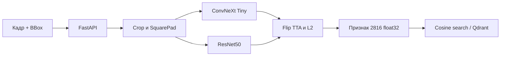

# Архитектура Vehicle Re-ID

## Поток данных

Backend принимает исходный JPEG/PNG и BBox в формате `x, y, width, height`.
ML ограничивает BBox границами кадра, сохраняет пропорции автомобиля,
дополняет кроп до квадрата и приводит его к 256×256.

Две модели формируют L2-нормированные векторы размерности 768 и 2048. После
усреднения предсказаний исходного и отражённого изображения части объединяются
с коэффициентами `sqrt(0.5)`. Итоговый вектор размерности 2816 также имеет
норму 1, поэтому его скалярное произведение равно среднему cosine моделей.

Номерные знаки не распознаются, не сохраняются и не передаются в API. Внешние
данные допускаются в обучение только после ручной проверки и маскирования
номеров и лиц.

## Компоненты

| Каталог | Ответственность |
|---|---|
| `ml/reid` | обучение, препроцессинг и инференс |
| `ml/eval` | метрики, поиск порога отказа |
| `ml/weights` | компактные deployment checkpoint в Git LFS |
| `backend` | валидация HTTP-запроса и вызов модели |
| `frontend` | демонстрационная загрузка кадра и результат |
| `ml/submission` | воспроизводимый экспорт для проверки |

Точный JSON-контракт и правила версионирования описаны в
[`ML_BACKEND_CONTRACT.md`](../ML_BACKEND_CONTRACT.md).
